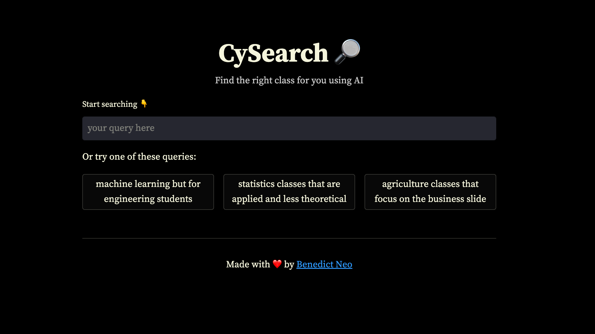

# Iowa State University Course Search

Inspired by [Jayadityas](https://www.linkedin.com/in/jayadityasethi/) and his app [BerkeleyQuest](https://berkeley.streamlit.app/), I decided to built a semantic course search for Iowa State.

I scraped a total of 8493 classes using [scrape.py](/scrape.py) from the [course catalog page](https://catalog.iastate.edu/azcourses/)

The embeddings were created using OpenAI's Ada embedding model in [embed.py](/embed.py)

Total cost for embedding ~500k tokens was $0.20. And it took ~40 minutes.

## TODO

- [ ] separate undergrad and grad level somehow (500 above is grad?)
- [ ] scrape [experimental courses](https://www.registrar.iastate.edu/faculty-staff/courses/explistings) too
- [ ] switch from csv to Chroma [chroma.py](/chroma.py) (currently loading and converting embeddings into string causes a long initial load time)
  - Tried out Chroma based on this [tutorial](https://github.com/openai/openai-cookbook/blob/main/examples/vector_databases/Using_vector_databases_for_embeddings_search.ipynb) but it keeps resetting my notebook instance.

## References

- [Amazon food reviews](https://github.com/openai/openai-cookbook/blob/main/examples/Obtain_dataset.ipynb)
- [Embeddings - OpenAI API](https://platform.openai.com/docs/guides/embeddings/what-are-embeddings)
